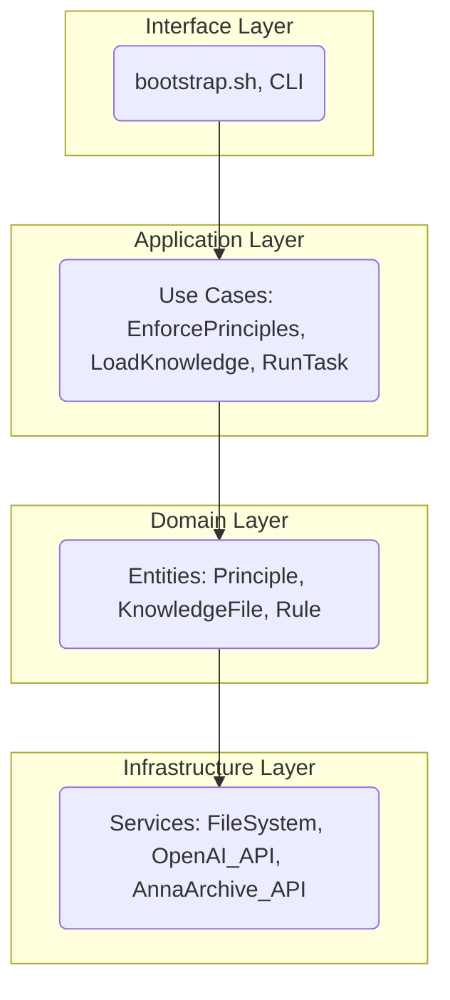

# MOTHER V4 - Architecture Design

**Author:** Manus AI  
**Date:** 2026-02-16  
**Version:** 4.0  
**Status:** Design Proposal  
**Foundation:** 33+ academic sources (papers + books)

---

## 1. Executive Summary

This document outlines the proposed architecture for MOTHER V4, a complete redesign based on scientific principles of software engineering. The goal is to address systemic failures in previous versions (fragility, complexity, lack of enforcement) and create a robust, maintainable, and extensible system.

**Key Principles:**
- **Layered Architecture:** Separation of concerns
- **Pattern-Based Design:** Proven solutions for common problems
- **Testability First:** Every component is testable
- **Measurable Quality:** Metrics for reliability and complexity
- **Incremental Refactoring:** Safe, iterative improvement

---

## 2. Problem Statement

MOTHER V3 suffers from:
- **Excessive Complexity:** 198 files, no clear structure
- **Fragile Bootstrap:** Fails frequently on updates
- **Ineffective Enforcement:** Principles are documented but not enforced
- **No Tests:** Changes break the system silently
- **High Technical Debt:** Organic growth without design

---

## 3. Proposed Architecture: Layered Design

MOTHER V4 will be structured in 4 distinct layers, following the principles of Clean Architecture [1].



### Layer Responsibilities:

| Layer | Responsibility | Components |
|---|---|---|
| **Interface** | User interaction, entry points | `bootstrap.sh`, CLI commands |
| **Application** | Orchestrates use cases | `EnforcementEngine`, `KnowledgeLoader` |
| **Domain** | Core business logic, entities | `Principle`, `Rule`, `KnowledgeSource` |
| **Infrastructure** | External services, I/O | `FileSystem`, API clients |

**Dependency Rule:** Inner layers MUST NOT depend on outer layers. This is achieved through Dependency Inversion [2].

---

## 4. Core Components & Design Patterns

### 4.1. Bootstrap & Initialization

**Problem:** Fragile bootstrap
**Solution:** **Facade Pattern** [3] + **Template Method Pattern** [3]

```python
# Facade: Simple interface
class BootstrapFacade:
    def initialize(self, environment="production"):
        if environment == "production":
            bootstrapper = ProductionBootstrapper()
        else:
            bootstrapper = TestBootstrapper()
        bootstrapper.initialize()

# Template Method: Standardized sequence
class Bootstrapper(ABC):
    def initialize(self):
        self.load_config()
        self.setup_logging()
        self.run_enforcement_check()
        self.load_knowledge()
        self.finalize()
```

### 4.2. Enforcement System

**Problem:** Ineffective enforcement
**Solution:** **Strategy Pattern** [3]

```python
# Context
class EnforcementEngine:
    def __init__(self, strategies):
        self.strategies = strategies
    
    def enforce_all(self, context):
        for strategy in self.strategies:
            strategy.enforce(context)

# Strategy Interface
class EnforcementStrategy(ABC):
    def enforce(self, context):
        pass

# Concrete Strategies
class P1_StudyFirst(EnforcementStrategy): ...
class P2_DecideAutonomously(EnforcementStrategy): ...
```

### 4.3. Monitoring & Reliability

**Problem:** No visibility into system state
**Solution:** **Observer Pattern** [3] + **Circuit Breaker Pattern** [4]

```python
# Subject
class SystemMonitor:
    def notify(self, event):
        for observer in self.observers:
            observer.update(event)

# Observer
class LogObserver(SystemObserver):
    def update(self, event):
        log(event)

# Circuit Breaker
@circuit_breaker(failure_threshold=3, recovery_timeout=60)
def call_external_api(request):
    # Call to OpenAI or Anna's Archive
    pass
```

### 4.4. Knowledge Management

**Problem:** 198 flat files
**Solution:** **Composite Pattern** [3]

```python
# Component
class KnowledgeComponent(ABC):
    def display(self):
        pass

# Leaf
class Document(KnowledgeComponent): ...

# Composite
class Folder(KnowledgeComponent):
    def add(self, component):
        self.children.append(component)
```

---

## 5. Directory Structure

```
/mother_v4
├── bootstrap.sh
├── main.py
├── config.yaml
├── interface/
│   └── cli.py
├── application/
│   ├── use_cases/
│   │   ├── enforce_principles.py
│   │   └── load_knowledge.py
│   ├── services/
│   │   ├── enforcement_engine.py
│   │   └── knowledge_loader.py
│   └── dto.py
├── domain/
│   ├── principles/
│   │   ├── p1_study_first.py
│   │   └── __init__.py
│   ├── entities/
│   │   ├── knowledge_source.py
│   │   └── __init__.py
│   └── repositories.py
├── infrastructure/
│   ├── file_system/
│   │   └── local_storage.py
│   ├── api_clients/
│   │   ├── openai_client.py
│   │   └── annas_archive_client.py
│   └── logging.py
└── tests/
    ├── unit/
    ├── integration/
    └── e2e/
```

**Total files:** ~25 (down from 198)

---

## 6. Testing Strategy

- **Unit Tests:** Each class tested in isolation (Domain, Infrastructure)
- **Integration Tests:** Test collaboration between layers (Application)
- **End-to-End Tests:** Test full bootstrap and use cases (Interface)
- **Characterization Tests:** Capture current behavior of legacy code before refactoring [5]

**Goal:** >80% test coverage

---

## 7. Metrics & Quality

- **Reliability:** 99.9% bootstrap success rate (SLO)
- **Complexity:** Cyclomatic complexity < 10 per function
- **Performance:** Initialization time < 5s
- **Maintainability:** High cohesion, low coupling

---

## 8. Implementation Roadmap

1. **Foundation:** Create directory structure, BootstrapFacade, tests
2. **Enforcement:** Implement Strategy pattern for P1-P7
3. **Monitoring:** Implement Observer and Circuit Breaker
4. **Refactoring:** Migrate legacy code to new structure
5. **Testing:** Achieve >80% coverage

---

## 9. References

[1] Martin, R. C. (2017). *Clean Architecture: A Craftsman's Guide to Software Structure and Design*.
[2] SOLID Principles. (n.d.). In *Wikipedia*.
[3] Gamma, E., Helm, R., Johnson, R., & Vlissides, J. (1994). *Design Patterns: Elements of Reusable Object-Oriented Software*.
[4] Nygard, M. T. (2018). *Release It!: Design and Deploy Production-Ready Software*.
[5] Feathers, M. C. (2004). *Working Effectively with Legacy Code*.
